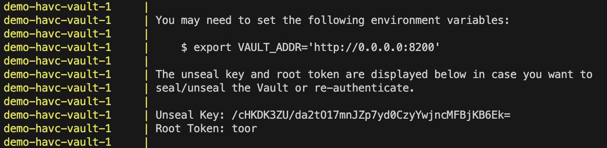
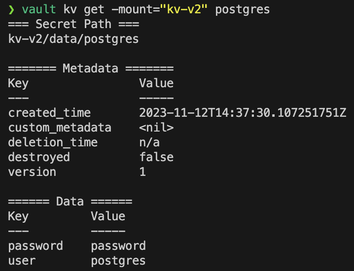
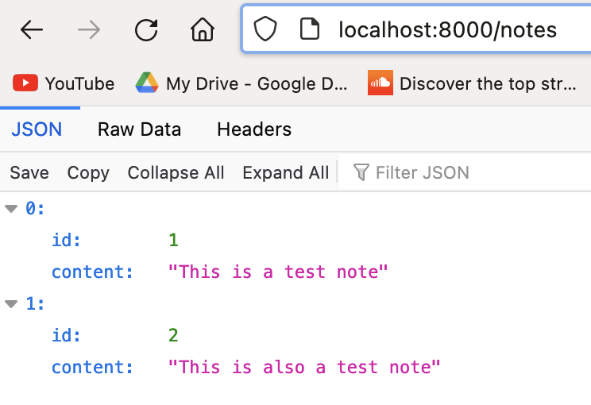
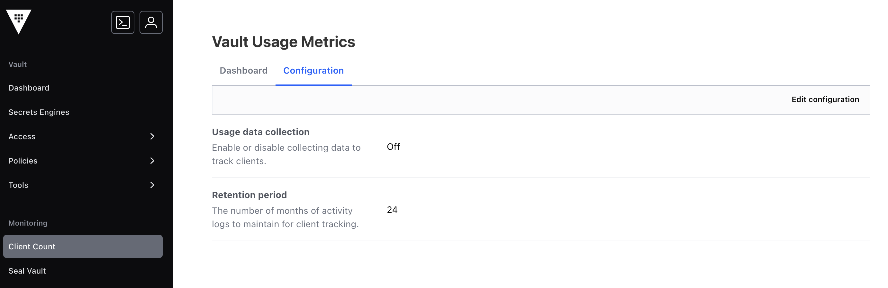
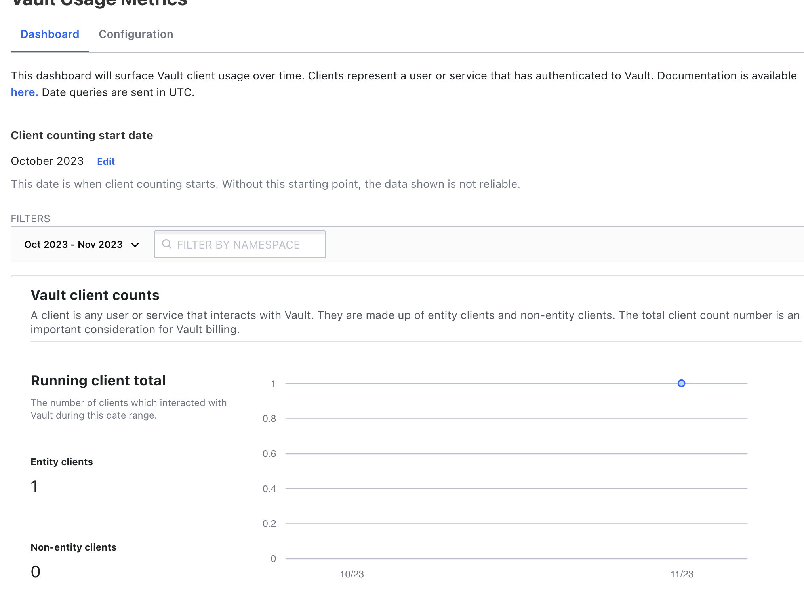
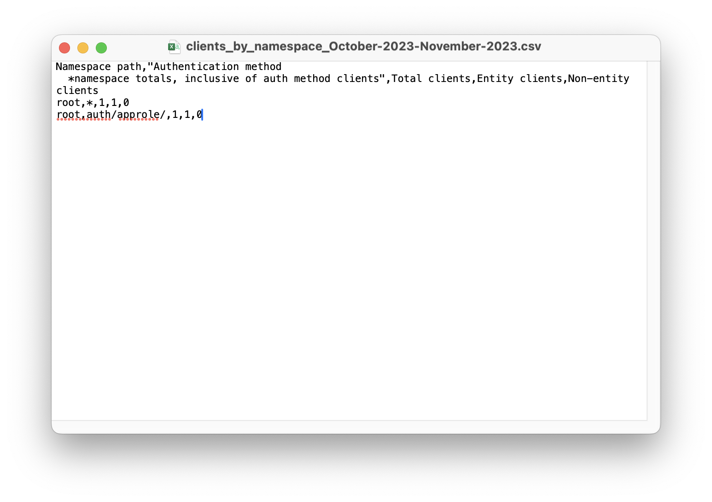

# Demo HashiCorp Vault

Group: BT
Team Members:

|Member|Student ID|
|--------|---|
|Pham Quang Binh| 2270663|
|Nguyen Duc Thuy| 2012158|

Github repository: [https://github.com/ducthuy-ng/hvac-demo](https://github.com/ducthuy-ng/hvac-demo)

---
## Setup infrastructures
In this tutorial, we will spawn up 2 Docker containers to simulate our system. The containers are:

1. Hashicorp Vault server (as ours IAM system)
2. PostgreSQL (as the database)

Inside the repository, we include a demo `docker-compose.yaml` file for this instance.

```shell
docker compose up
```

Docker Compose will run and logs from our database and Vault will be displayed in the terminal.
Check for the log similar to below:



<!-- The **Unseal Key** will be use through this demo to perform admin authentication. -->

## Create Vault secrets

### Login to Vault

We first need to login to Vault before we can do other operations:

```shell
vault login
```

If error, try to  run the below script **in the same terminal** to point Vault CLI to the correct server location:
```shell
export VAULT_ADDR='http://localhost:8200'
```

### Create Secret Engine and add PostgreSQL credentials

Let us first create a specific **Secret Engine** in our Vault. Using that, we add 2 pairs of key-value secrets, storing the username and the password of the PostgreSQL database.

```shell
vault secrets enable -version=2 -path="backend-secret" -description="Test K/V v2" kv


vault kv put -mount="backend-secret" postgres user=postgres password=password
```

We are currently using Secret engine of Key-Vault - version 2. For comparison with version 1, visit the documentation: [KV secrets engine](https://developer.hashicorp.com/vault/docs/secrets/kv).

To check whether the secret has been added successfully, try getting back the secret

```shell
vault kv get -mount="backend-secret" postgres
```



## Setting up Vault for Backend Role
Another mode for working with HashiCorp Vault is to create multiple Authentication Methods. This can help centralize our Identity & Access Management (IAM).

AppRole is used mainly for automatic system. However, in scope of this demo, we will use it to demonstrate Vault authentication and authorization capability.

### Create AppRole Authentication

```shell
# Create a new role for our Backend
vault write -f auth/approle/role/backend-api

# By default, Vault generate a Role ID as one of the credentials.
vault read auth/approle/role/backend-api/role-id

# Sample output
#
# Key        Value
# ---        -----
# role_id    00e45e77-547c-5b16-6f2a-f491f8401edc

# Make Vault generate a new Secret ID. This is the last part of this authentication mode requirements.
vault write -f auth/approle/role/backend-api/secret-id

# Sample output
# Key                   Value
# ---                   -----
# secret_id             4255f32e-1fea-d70e-bb74-53d60bda6b2a
# secret_id_accessor    5227cdef-30d0-5eb2-81d3-424add5d2613
# secret_id_num_uses    0
# secret_id_ttl         0s
```

### Authorization

First, create a **Policy** to access our newly created secret. The file content of `backend-policy.hcl` would be:

```hcl
path "backend-secret/data/*" {
    capabilities = ["read"]
}
```

Then to create a new policy based on this, we use
```shell
vault policy write backend-policy ./backend-policy.hcl 
```

This will create a new Policy called `backend-policy`. Assigning this to our Backend role:

```shell
# A comma seperated string of policies
vault write auth/approle/role/backend-api token_policies='backend-policy'

vault read auth/approle/role/backend-api/policies
# Sample output
# Key               Value
# ---               -----
# token_policies    ['backend-policy']
```

## Getting credentials from Backend API

Inside this project `note_api`, our team includes a small Python FastAPI to demonstrate the login of external libraries to HashiCorp Vault.

Inside `app.py`, here is the code that fetch the `postgres` secret:

```python
# app.py

...
# This value should be stored in $env
# Login using predefined AppRole
vault_client = hvac.Client(url="http://localhost:8200")
vault_client.auth.approle.login(
    role_id="00e45e77-547c-5b16-6f2a-f491f8401edc",
    secret_id="4255f32e-1fea-d70e-bb74-53d60bda6b2a",
)
...

# Reading the secret
secret_read_response = vault_client.read('/backend-secret/data/postgres')
if not secret_read_response:
    raise Exception("Cannot read secret from Vault")

username = secret_read_response['data']['data']['username']
password = secret_read_response['data']['data']['password']


```

If setup correctly, running the server that `http://localhost:8000/notes`, we can read the PostgreSQL table:




## View access count
Using HashiCorp Vault, we can also monitor our client access for security purposes.

From the Vault's webserver, go to **Client Count** > **Configuration** and enabled **Usage data collection**.



Then re-run the Backend API, this access will be recorded to the log:



Access can also be export for further investigation:


